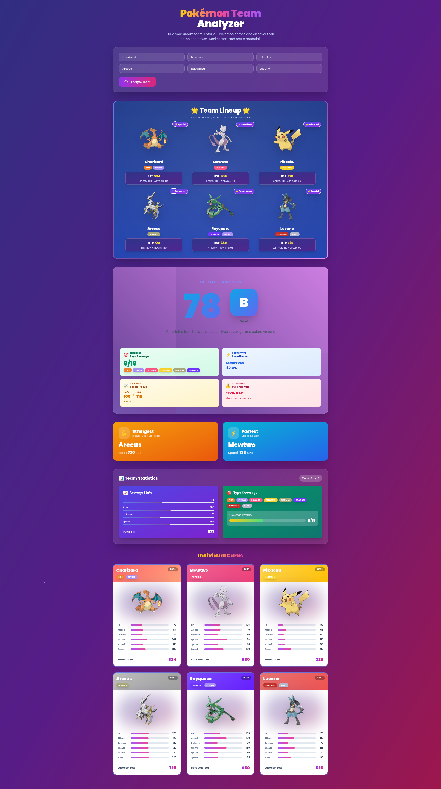

# Pokémon Team Analyzer

Pokémon Team Analyzer is a single-page web app that evaluates teams of two to six Pokémon, highlighting strengths, weaknesses, and squad synergy with a polished Trading Card Game-inspired presentation. This project was created as a tutorial example demonstrating how to build a serverless web application that integrates with n8n workflows for backend processing.

## Screenshot



> Replace `docs/screenshot-placeholder.png` with a landscape capture of the analyzer in action.

## Features

- Submit up to six Pokémon and receive overall scoring, grade, and narrative analysis.
- Animated lineup preview with dynamic team cards styled after the Pokémon TCG.
- Type coverage insights, stat breakdowns, and highlight callouts for clutch performers.
- Webhook-powered analysis pipeline using a background n8n workflow (included in the `n8n/` folder).

## Getting Started

### Deployment on Netlify (Recommended)

1. **Deploy to Netlify:**
   - Connect your repository to Netlify
   - Netlify will automatically detect the configuration from `netlify.toml`

2. **Set Environment Variables in Netlify:**
   - Go to your site's dashboard
   - Navigate to **Project configuration > Environment variables**
   - Add variable:
     - Key: `WEBHOOK_URL`
     - Value: Your n8n webhook URL (e.g., `https://n8n.example.com/webhook/pokemon-team-analyzer`)
     - Scopes: `Functions` (required)
     - Deploy contexts: `Production`, `Deploy Previews`, `Branch deploys` (as needed)

3. **Deploy:**
   - Trigger a new deploy (manual or push to your branch)
   - Visit your Netlify site URL
   - Enter 2–6 Pokémon names and click **Analyze Team**

### Local Development with Netlify Dev

1. **Install Netlify CLI:**
   ```bash
   npm install -g netlify-cli
   ```

2. **Configure Environment Variables:**
   ```bash
   # Copy the example file
   cp .env.example .env

   # Edit .env and set your webhook URL
   # WEBHOOK_URL=https://n8n.example.com/webhook/pokemon-team-analyzer
   ```

3. **Run Netlify Dev:**
   ```bash
   netlify dev
   ```

4. **Visit** `http://localhost:8888` in your browser

### Alternative: Local Development without Netlify

If you want to test the frontend only without the Netlify function:

1. Launch a local server:
   ```bash
   python3 -m http.server 5173
   # or
   npx http-server .
   ```

2. Note: The Netlify function won't be available. You'll need to modify the code to point directly to your webhook or mock the responses.

## Configuration

### Netlify Environment Variables

The app uses Netlify Functions to securely proxy requests to your n8n webhook. Configure the following environment variable:

- **WEBHOOK_URL**: Your n8n webhook endpoint URL
  - Set in: Netlify UI (Project configuration > Environment variables)
  - For local dev: Create `.env` file (see `.env.example`)
  - Scope: `Functions` (required for Netlify Functions)
  - **Never commit** your `.env` file - it's already in `.gitignore`

### Import from .env file (Optional)

You can also import environment variables in bulk from a .env file in the Netlify UI:

1. Go to **Project configuration > Environment variables**
2. Click **Add a variable > Import from a .env file**
3. Paste your .env contents
4. Set scopes and deploy contexts

Learn more: [Netlify Environment Variables Documentation](https://docs.netlify.com/environment-variables/get-started/)

## Manual Testing Checklist

- Empty submission displays a validation error.
- Submit valid teams with mixed types, mono-type rosters, and deliberately invalid names to verify scoring and error states.
- Confirm the loader, scorecard animations, and stat bars render correctly across desktop and mobile viewports.
- Inspect webhook requests in your browser dev tools and confirm responses arrive as expected.

## Tech Stack

- Static HTML powered by the Tailwind CSS CDN.
- Vanilla JavaScript for form handling, rendering helpers, and animation coordination.
- Netlify Functions for secure webhook proxying.
- n8n workflow for backend team analysis logic (see `n8n/workflow.json` for the tutorial workflow).

## Project Structure

```
.
├── index.html                     # Main application (markup, styling, scripting)
├── n8n/                           # n8n related files
├── netlify/
│   └── functions/
│       └── analyze.js             # Netlify Function (proxies to n8n webhook)
├── n8n/
│   └── workflow.json              # n8n workflow used in the tutorial
├── netlify.toml                   # Netlify configuration
├── .env.example                   # Environment variables template
├── .gitignore                     # Git ignore rules (includes .env)
└── README.md                      # This file
```

### Key Files

- **index.html**: Complete single-page application with Tailwind CSS styling and vanilla JavaScript
- **netlify/functions/analyze.js**: Serverless function that securely proxies requests to your n8n webhook
- **n8n/workflow.json**: The n8n workflow configuration used in the tutorial - import this into your n8n instance
- **.env.example**: Template for local environment variables (copy to `.env` for local development)
- **netlify.toml**: Netlify build configuration (automatically detected on deploy)

## Migration from env.js (Legacy)

If you're using the old `env.js` configuration:

1. The app now uses Netlify Functions exclusively
2. Set `WEBHOOK_URL` in Netlify UI or `.env` file (not `env.js`)
3. The `env.js` approach is deprecated but still gitignored for safety

Enjoy building dream Pokémon teams and fine-tuning your battle strategies!
